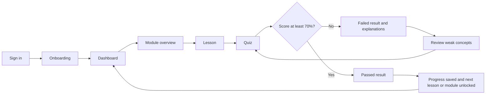

# PromptShala Participant UX Plan

Status: Design baseline for client review. This document covers the participant journey only; facilitator and administrator screens are outside this prototype pass.

## 1. Design objective

Help Meera, a beginner Classes 5–10 teacher, resume and complete a short learning activity without technical jargon. Within 20–30 minutes she should understand what to do next, complete a lesson and quiz, see why an answer was wrong, retry safely, and understand exactly how the next item unlocks.

## 2. Primary participant flow

### Flow rules

1. A returning participant bypasses completed onboarding and lands on the dashboard.
2. The dashboard always shows one dominant action: `Resume learning` or `Start Module 1`.
3. A module overview explains outcomes, time estimate, activities and prerequisites before entry.
4. Lesson progress autosaves. Video has captions and transcript; text remains usable on slow connections.
5. The quiz shows one question per step on mobile and a focused question panel on desktop.
6. Submission enters an explicit loading state and prevents duplicate submissions.
7. A score below 70% shows explanations, the strongest and weakest concepts, and `Review and retry`.
8. A score of 70% or more shows the retained score, completed requirements and the newly unlocked item.
9. Locked content is visible but explains the exact requirement; it is never represented by an unexplained disabled control.
10. Offline or failed submissions preserve answers and never claim progress was saved until synchronization succeeds.

## 3. Screen inventory

| ID | Screen | Main purpose | Primary action | Required variants |
|---|---|---|---|---|
| P01 | Sign in | Enter PromptShala securely | Continue with email | Default, loading, validation error, session expired |
| P02 | Welcome and safe-use notice | Explain purpose, AI limitations and privacy | I understand, continue | Default, scroll-complete |
| P03 | Teacher profile | Capture class range, subject and experience | Save and continue | Default, validation error |
| P04 | AI familiarity and goals | Personalize examples without testing the teacher | Continue to dashboard | Empty, selected, saving |
| P05 | Dashboard | Resume, see progress and four-module pathway | Resume learning | First visit, active progress, all complete, loading, offline |
| P06 | Module overview | Explain outcomes, prerequisites and sequence | Start or continue module | Available, in progress, completed, locked |
| P07 | Lesson player | Complete micro-video or reading | Mark complete / Continue | Loading, video, reading, transcript open, completed, offline cached |
| P08 | Quiz question | Answer a concept-check question | Next / Submit quiz | Unanswered, selected, validation, submitting |
| P09 | Quiz failed result | Explain score and support retry | Review and retry | Failed, answers preserved, retry loading |
| P10 | Quiz passed result | Confirm pass and unlock | Continue to unlocked item | Passed at threshold, high score, progress saving |
| P11 | Locked-item detail | Explain why an item is locked | Go to required activity | Locked by lesson, locked by score |
| P12 | Progress view | Show evidence, attempts and outstanding requirements | Continue next activity | Active, empty history, module complete |
| P13 | Prompt practice preview | Show the next interactive learning experience | Start prompt practice | Available, locked, loading |
| P14 | Profile and preferences | Edit teacher context and accessibility preferences | Save changes | Default, saving, success, error |
| P15 | Connectivity/error recovery | Preserve work and explain recovery | Retry / Work with cached lesson | Offline, server error, timeout |

## 4. Shared components

- Responsive app header: PromptShala identity, current module, profile menu and connection status.
- Desktop side navigation and mobile bottom navigation: Home, Learn, Progress, Profile.
- Breadcrumb on desktop and compact back/title pattern on mobile.
- Progress bar with visible percentage and text equivalent.
- Four module cards with `Not started`, `In progress`, `Completed` or `Locked` labels.
- Lesson activity list using icons plus text, not colour alone.
- Video player placeholder, captions toggle and full transcript drawer/panel.
- Quiz step indicator such as `Question 2 of 5`.
- Feedback card separating `What happened`, `Why`, and `What to do next`.
- Toast/live-region messages for saved progress and recoverable errors.
- Persistent privacy reminder near AI or upload-related activities: do not enter identifiable student data.

## 5. Responsive behaviour

### Mobile: 360–430 px

- Single-column layout with 16 px outer padding and no horizontal scrolling.
- Minimum 44 by 44 px interactive targets.
- One primary action fixed near the bottom only when it does not cover content.
- Module cards stack vertically; lesson activity list remains full width.
- Quiz options are full-width cards; results and explanations stack.
- Transcript opens as a full-height sheet or inline section.
- Navigation uses a labelled bottom bar with no more than four destinations.

### Tablet: 768–1024 px

- Two-column dashboard where useful; maintain readable line lengths.
- Side navigation may collapse into a drawer.
- Lesson media and transcript can appear as balanced panels.

### Desktop: 1280–1440 px

- Maximum content width around 1200 px with a persistent left navigation.
- Dashboard uses a prominent continue card plus four-module grid and next-requirement panel.
- Lesson uses main content plus a narrow activity/progress rail.
- Quiz remains focused; avoid filling the width with dense content.
- Result screens may use a two-column score/explanation arrangement.

## 6. Required system states

| State | Design requirement | Example copy |
|---|---|---|
| Loading | Skeletons matching final layout; retain page title; announce loading | `Loading your learning progress…` |
| Empty | Explain why empty and provide a useful first action | `Your learning journey starts here.` |
| Locked | Show requirement, progress toward it and route back | `Complete Lesson 1 and score 70% in Quiz 1 to unlock.` |
| Passed | Show score, pass threshold, saved status and unlocked item | `You passed with 80%. Module 2 is now available.` |
| Failed | Avoid blame; explain threshold, weak concepts and retry | `You scored 60%. Review two concepts and try again.` |
| Saving | Disable duplicate submission but keep context visible | `Saving your attempt…` |
| Offline | Preserve local input and distinguish unsynced work | `You’re offline. This answer is saved on this device, not submitted.` |
| Error | Plain-language cause when known, preserved work and recovery action | `We couldn’t submit the quiz. Your answers are safe.` |
| Completed | Celebrate briefly and present the next purposeful action | `Module 1 complete. Continue to Prompt Engineering.` |

## 7. Accessibility requirements

- Target WCAG 2.2 AA for critical participant journeys.
- Use semantic headings, landmarks, lists, buttons, forms and progress elements.
- Maintain logical keyboard order and highly visible focus rings.
- Provide persistent labels; placeholders are examples, not labels.
- Associate validation errors with fields and move focus to the error summary after submission.
- Meet at least 4.5:1 contrast for normal text and 3:1 for large text and interface components.
- Never use colour alone for module, quiz or connectivity status; include text and icons.
- Support 200% zoom and reflow at 320 CSS px without horizontal page scrolling.
- Use captions and transcripts for every instructional video.
- Announce progress saves, quiz submission and result changes through an appropriate live region.
- Respect reduced-motion preferences; do not use auto-playing decorative motion.
- Keep language direct, encouraging and free of unexplained AI terminology.
- Use accessible names such as `Module 2, locked` rather than a lock icon alone.

## 8. Teacher persona mapping

| Screen or feature | Meera’s need or barrier | Design response |
|---|---|---|
| Sign in and onboarding | Comfortable with familiar forms but new to AI platforms | Short form, familiar wording, clear step count and no API setup |
| Teacher profile | Needs age-appropriate classroom examples | Capture class range and subject once, explain why it improves examples |
| Safe-use notice | Worries about incorrect output, privacy and copyright | Plain-language no-student-PII rule and visible teacher-review responsibility |
| Dashboard | Has limited preparation time | One dominant resume action, visible time estimate and saved progress |
| Four-module pathway | Needs to know where she is and what remains | Status labels, percentage, prerequisites and exact unlock rules |
| Lesson player | Prefers doing over long theory and may have weak connectivity | Micro-content, transcript, captions, cached reading and resume state |
| Quiz | Needs immediate, non-judgmental learning feedback | Focused questions, clear explanations and unlimited guided retries |
| Failed state | May feel unskilled after a poor result | Encouraging language, weak-concept summary and direct path to review |
| Passed/unlock state | Needs visible evidence of improvement | Score, threshold, completion confirmation and next unlocked activity |
| Mobile layout | Often uses a personal Android phone | Single column, large targets, short screens and no horizontal scrolling |
| Offline/error recovery | Connectivity may vary | Preserve answers, show sync status and provide a safe retry |
| Accessibility options | Teaches diverse learners and may need flexible presentation herself | Readable text, captions, keyboard support, contrast and reduced motion |

## 9. Prototype interaction map

The clickable prototype must include these links:

1. `P01 Continue` → `P02`.
2. `P02 Continue` → `P03`.
3. `P03 Save and continue` → `P04`.
4. `P04 Continue to dashboard` → `P05 first visit`.
5. `P05 Start Module 1` → `P06 available`.
6. `P06 Start lesson` → `P07`.
7. `P07 Continue to quiz` → `P08`.
8. `P08 Submit` → loading → either `P09 failed` or `P10 passed`.
9. `P09 Review and retry` → `P07 review point` → `P08 retry`.
10. `P10 Continue` → `P05 active progress` with the next item unlocked.
11. Selecting a locked module on `P05` → `P11` → required activity.
12. Progress navigation → `P12`; profile navigation → `P14`.

## 10. Client review decisions

- Confirm whether onboarding may be skipped for returning or invited participants.
- Confirm the final quiz pass threshold; HLD currently proposes 70%.
- Confirm whether retries are unlimited and whether highest score is retained; HLD proposes both.
- Confirm final four learning-module titles and approved sample content.
- Validate the selected CRAFT labels—Context, Role, Action, Format and Target—with beginner teachers before final Module 2 scoring is locked.
- Confirm whether certificate/progress screens are included in the first design review or a later module.
